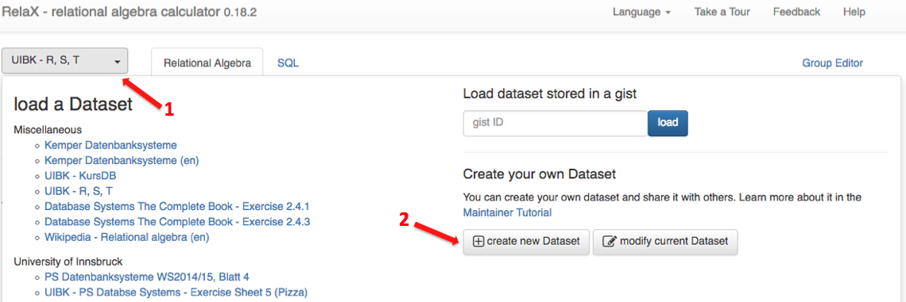
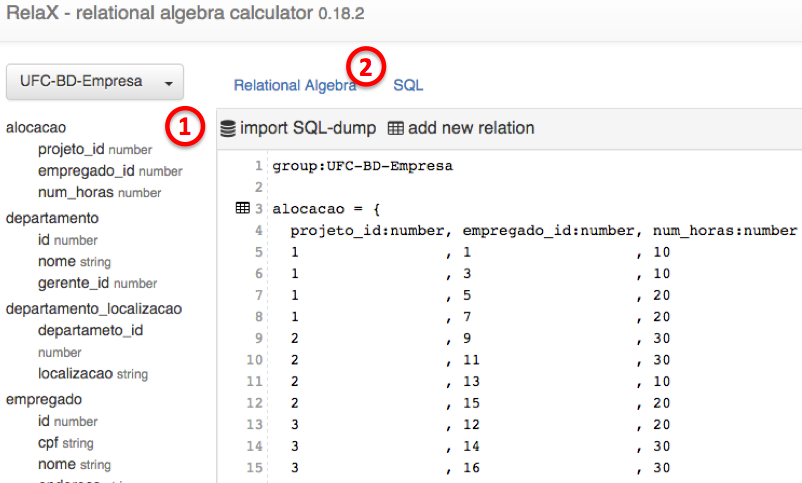

## UFC - Fundamentos de Bancos de Dados
# RelaX - relational algebra calculator

Para utilizar o nosso banco de dados no RelaX, você pode seguir os passos abaixo:

* Acesse o site da ferramenta: http://dbis-uibk.github.io/relax/calc.htm
* Clique no menu superior esquerdo `UIBK - R, S, T` (1) e em seguida no botão `create new Dataset` (2), conforme a imagem a seguir:

* Copie o conteúdo do arquivo [relax-bd-empresa.txt](relax-bd-empresa.txt) no editor exibido
* Clique no botão `preview`, na parte inferior.
* Os dados serão exibidos, em seguida, clique no botão `use Group in editor`, na parte inferior
* As relações (tabelas) do bancos já devem ser estar exibidas no canto superior esquerdo (1), conforme a imagem abaixo:

* Clique em `Relational Algebra`, apresentado na imagem acima (2), e comece a realizar as consultas.
